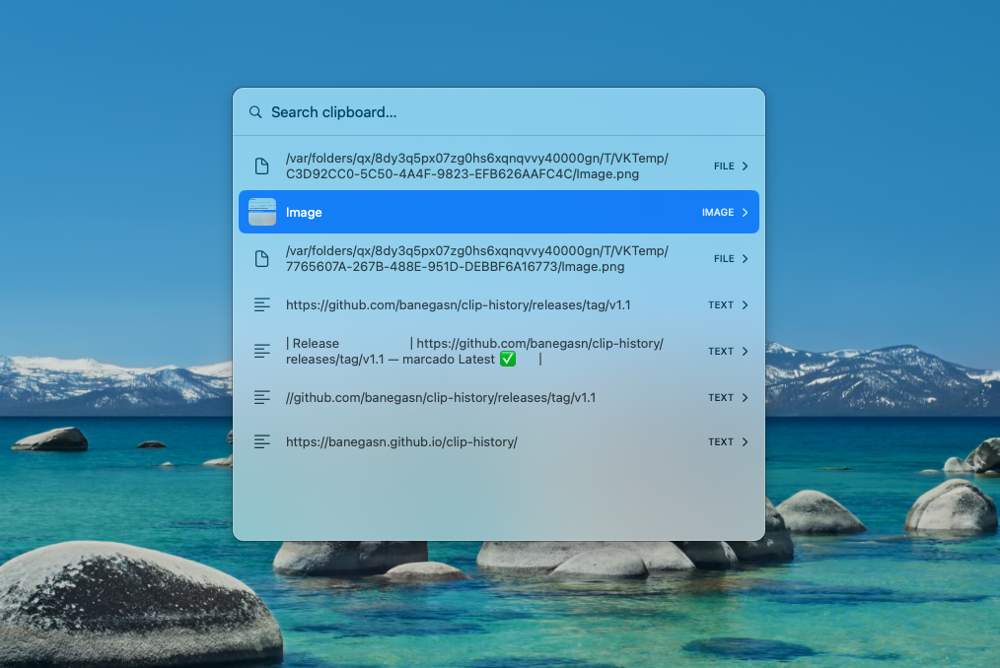

# ClipHistory

A tiny, open-source macOS clipboard-history manager — an MIT-licensed alternative
to apps like *Paste*. Lives in the menu bar, captures everything you copy, and
brings it back with **⇧⌘V**.

 

<p align="center">
  
</p>

## Download

**[⬇︎ Download the latest .dmg](https://github.com/banegasn/clip-history/releases/latest)** — open it, drag **ClipHistory** to **Applications**, then:

1. The app isn't notarized by Apple, so on first launch macOS warns it "cannot be checked". Open **System Settings ▸ Privacy & Security** and click **Open Anyway** (or run `xattr -dr com.apple.quarantine /Applications/ClipHistory.app`).
2. Grant **Accessibility** when asked — required so it can paste with ⌘V.

Prefer to build it yourself? See [Build & run](#build--run) below.

## Features

- **⇧⌘V** opens a centered, searchable history panel.
- Captures **text, images, and files** copied from anywhere.
- **Persists to disk** (SQLite) and survives reboots — capped at the 200 most recent items.
- **Type to filter**, ↑/↓ to move, **Enter** (or click) to paste straight into the app you were using, **Esc** to dismiss.
- **→ expands** a clip to its full content (multi-line text, larger image); **←** or **Esc** goes back. Rows show a 2-line preview.
- **Delete an entry** with ⌘⌫ (or ⌫/⌦ when the search box is empty).
- **Pin favorites** with ⌘P — pinned clips float to the top and are never evicted by the 200-item cap.
- **Jump 5 rows** at a time with ⌥↑ / ⌥↓.
- Detail view shows an **Open Link** button when the clip is a web URL.
- Menu-bar only — no Dock icon, no window clutter.
- Skips content marked *concealed*/*transient* by password managers.

## Requirements

- macOS 14+
- Swift toolchain (Xcode or Command Line Tools — `xcode-select --install`)

## Build & run

```bash
./setup-signing.sh      # once: creates a stable self-signed code-signing identity
./build-app.sh          # compiles + assembles (+ installs to /Applications if present)
open ClipHistory.app    # launch it
```

To install: `cp -R ClipHistory.app /Applications/`. Once it lives in
`/Applications`, `./build-app.sh` refreshes that copy in place on every build.

Prefer SwiftPM directly? `swift run -c release` works too (but you won't get the
`.app` bundle / menu-bar agent niceties).

### Why `setup-signing.sh`?

macOS grants Accessibility permission against a binary's *designated requirement*.
An **ad-hoc** signature embeds the binary hash, so every rebuild invalidates the
grant. `setup-signing.sh` creates a self-signed code-signing certificate; the
build then signs with it, producing a stable requirement
(`identifier "com.nico.cliphistory" and certificate leaf = H"…"`) that survives
rebuilds. Grant Accessibility once and you're done.

## First-run permissions

macOS will ask for **Accessibility** permission the first time. This is required
so the app can synthesize the ⌘V keystroke that pastes the chosen item into your
previously-focused app.

- System Settings ▸ Privacy & Security ▸ **Accessibility** → enable **ClipHistory**.

Without it, selecting an item still copies it to the clipboard — you'd just press
⌘V yourself.

> With `setup-signing.sh` done, the grant survives rebuilds. Running from
> `/Applications` is recommended for the most stable experience. If you ever
> switch signing identity, reset the stale grant with
> `tccutil reset Accessibility com.nico.cliphistory` and re-grant once.

## How it works

| Concern | Approach |
|---|---|
| Detect copies | Poll `NSPasteboard.changeCount` every 0.4s (macOS has no clipboard-change event). |
| Global shortcut | Carbon `RegisterEventHotKey` (system-wide, no Accessibility needed to *listen*). |
| Paste back | Re-activate the prior app, then post a synthetic ⌘V via `CGEvent` (needs Accessibility). |
| Storage | SQLite at `~/Library/Application Support/ClipHistory/store.sqlite`; images stored as PNG blobs, thumbnails kept in memory. |
| UI | SwiftUI panel hosted in a floating `NSPanel`. |

## Project layout

```
Sources/ClipHistory/
  main.swift            Entry point (accessory/menu-bar app)
  AppDelegate.swift     Wires status item, hotkey, monitor, panel together
  ClipboardMonitor.swift  Pasteboard polling + capture
  ClipboardStore.swift  SQLite persistence (insert/dedupe/cap/read)
  ClipItem.swift        Model
  ImageUtil.swift       Thumbnail generation
  HotKey.swift          Carbon global hotkey
  Paster.swift          Synthetic ⌘V into the prior app
  PanelController.swift  Floating NSPanel host
  PanelModel.swift      Observable panel state
  HistoryView.swift     SwiftUI list + search + keyboard nav
```

## License

MIT
